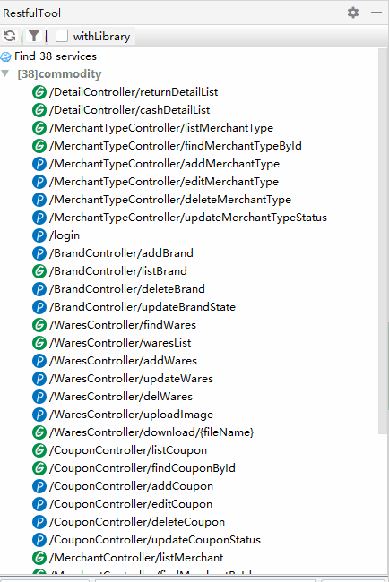

# RestfulTool

<em style="color: red">This is not define in [~~RestfulToolkit~~]()</u></em>

> - `min-version`: `201`
>   * Please move to [`RESTFulToolkit`](https://plugins.jetbrains.com/plugin/10292-restfultoolkit) to install and use that low version
> - `plugin-path`: [`RestfulTool`](https://plugins.jetbrains.com/plugin/14280-restfultool)

> + [Github](https://github.com/ZhangYuanSheng1217/RestfulTool)
> + [Gitee](https://gitee.com/zys981029/RestfulTool)

> - [中文](./README_zh.md)

#### Preface
    Since the original author of the RESTFulToolkit plug-in is not updated, IDEA.201 and above versions are no longer adapted, so this plug-in was made with reference to the plug-in project of the original author.
    Everyone is welcome to submit an issue | pr
    If you think it ’s not bad, please help me to tap start(*￣︶￣)thanks~

#### Info
> A set of auxiliary tools for Restful service development.
>> 1. Provides a display window of Services tree;
>> 2. Click the URL to jump directly to the corresponding method definition;
>> 3. A simple http request tool;
>> 4. Support Spring system (Spring MVC / Spring Boot);
>> 5. Support `Navigate-> Request Service` search Mapping` Ctrl + Alt + / `;

#### Install
> 1. IDEA plugin Search for `RestfulTool` installation (recommended)
> 2. Download the installation package from the [Jetbrains Plugins](https://plugins.jetbrains.com/plugin/14280-restfultool/versions) repository
> 3. Download `Restful Tool.zip` in the root directory of the project and install it locally

#### Use
> * search
>   - `navigation` > `Request Service`
>   - hotKey
>       - default: `Ctrl + Alt + /`
>       - change: `Setting` > `keymap` > `Plug-ins` > `RestfulTool`
> * view
>   - `right tool window` > `RestfulTool`
> - 

****
#### Fork
> - Add adapter icon scheme
>   - Put the 16 x 16 svg icon file into `/icons/method/{iconThemeName}`
>   - Icon naming method (only supports png | svg format): 
>
>       | FileName | Directions |
>       | :---: | :---: |
>       | `GET.[svg,png]`                    | The default icon requested by `GET`       |
>       | `GET_select.[svg,png]`             | Selected icon requested by `GET` method   |
>       | `POST.[svg,png]`                   | The default icon requested by `POST`      |
>       | `POST_select.[svg,png]`            | Selected icon requested by `POST`         |
>       | `${HttpMethod}[_select].[svg,png]` | (Checked) icon requested by `Http Method` |

>   - Refer to `/icons/method/default` or `/icons/method/cute`

#### Reference
> + Plugin address - [RESTFullToolkit](https://plugins.jetbrains.com/plugin/10292-restfultoolkit/)
> + Github - [RESTFullToolkit](https://github.com/mrmanzhaow/RestfulToolkit)
